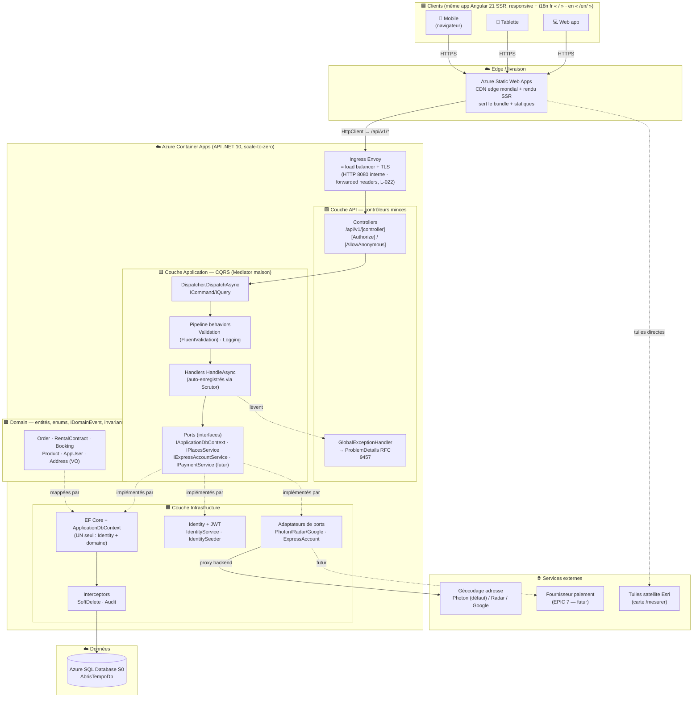
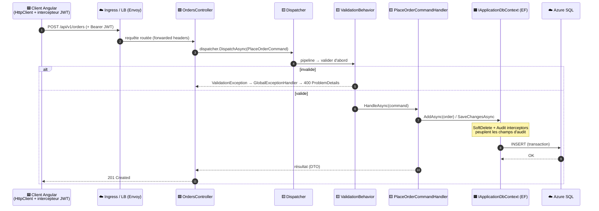
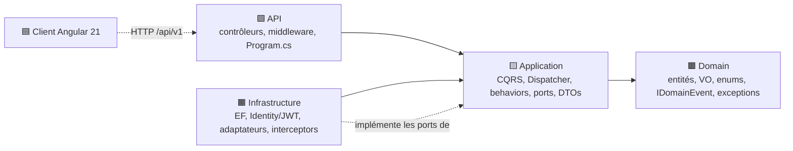
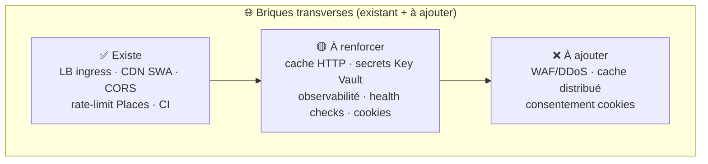

# Design système — du client à la base de données

> **Ce que c'est.** Le plan d'ensemble d'AbrisTempo Local : comment une action partie d'un **client**
> (mobile, tablette, web) traverse l'**edge**, l'**API**, les **couches Clean Architecture** et
> arrive jusqu'à la **base de données** — chaque constituant **annoté par sa couche**. Les diagrammes
> sont en **Mermaid** (rendu automatique sur GitHub). Une version **éditable** existe en parallèle :
> [`system-design.drawio`](./system-design.drawio) (ouvre-la dans [diagrams.net](https://app.diagrams.net)).
>
> Source de vérité = le code. Ce dépôt est un **monolithe modulaire** (.NET 10 / C# 14, Clean
> Architecture, **un seul** `ApplicationDbContext`, **Mediator maison**), front **Angular 21 SSR**.
> Pour le « pourquoi pas microservices », voir [`architecture-microservices.md`](../architecture-microservices.md).

---

## 1. Vue d'ensemble — déploiement & flux de bout en bout

Légende des couches : 🟦 **Client** · 🟩 **API** (contrôleurs minces) · 🟨 **Application** (CQRS /
Mediator) · 🟧 **Infrastructure** (EF, Identity, ports) · 🟫 **Domain** · ☁️ **Hébergement Azure** ·
🌐 **Services externes**.

**Points clés**
- Le **client unique** (mobile/tablette/web) est la **même** app Angular 21 SSR responsive ; la
  langue est décidée à la compilation (fr `/`, en `/en/`).
- L'**ingress Container Apps est déjà un load balancer** (Envoy) : TLS terminé à l'edge, HTTP interne
  sur 8080, d'où `ASPNETCORE_FORWARDEDHEADERS_ENABLED` (L-022) ; scale-to-zero + multi-réplicas.
- Le **géocodage passe par un proxy backend** (`IPlacesService`), **jamais** d'appel tiers direct du
  client. Les **tuiles Esri**, elles, sont chargées côté client par Leaflet (contenu statique public).
- **Une seule** base relationnelle (Identity **et** domaine dans le même `ApplicationDbContext`).

---

## 2. Chemin d'une requête, couche par couche

Exemple : un client passe une commande (`POST /api/v1/orders`). Même forme pour location, réservation,
catalogue, etc. — seuls le contrôleur et le handler changent.

> **Où vit l'authentification ?** Le **JWT** est émis par `IdentityService` en **Infrastructure** (ASP.NET
> Core Identity) ; le contrôleur applique `[Authorize]` / policies (`StaffOrAbove`, `AdminOnly`) en
> **API** ; les rôles (`Customer`/`Staff`/`Admin`) sont des constantes **Domain**. Côté client, un
> **intercepteur** ajoute le `Bearer` et `authGuard` protège les routes ; `ProfileService` met en
> cache `/auth/me` (signal) car le `AuthUser` du JWT ne porte pas l'adresse (L-003).

---

## 3. Règle des dépendances (Clean Architecture)

Les dépendances ne pointent que **vers l'intérieur**. Rien dans Domain/Application ne connaît
Infrastructure/API — l'inversion se fait par **ports** (interfaces dans Application, implémentés en
Infrastructure).

---

## 4. Briques manquantes / à expliciter + plan d'attaque

Le design ci-dessus reflète l'**état réel**. Plusieurs préoccupations transverses classiques sont soit
**implicites** (déjà là mais non documentées), soit **absentes** (à ajouter). Cette table est le
**backlog d'infrastructure** (repris en EPIC 16 de la roadmap Phase 2).

| Brique | État aujourd'hui | Plan d'attaque (du moins risqué au plus lourd) |
|--------|------------------|------------------------------------------------|
| **Load balancer** | ✅ **Déjà présent** — ingress Envoy de Container Apps (TLS + répartition multi-réplicas). | Le **documenter** (fait ici). Vérifier la santé multi-réplicas : `MigrateOnStartup` prend le verrou SQL (sûr, L-022). |
| **Cache** | 🟡 Partiel — cache CDN SWA (statiques) ; cache client en signaux (`ProfileService` met `/auth/me` en cache, L-003). Pas de cache HTTP/serveur sur les GET publics. | 1) En-têtes `Cache-Control`/ETag sur les GET catalogue (`/products`, `/categories`) — gain immédiat, faible risque. 2) `OutputCache`/`ResponseCache` côté API .NET. 3) Cache distribué (Redis) seulement si la charge le justifie. |
| **Cookies / session** | 🟡 Le **JWT est stocké côté client** (localStorage), pas de cookie `httpOnly`. Pas de bannière de consentement. | 1) Décider **JWT localStorage vs cookie `httpOnly` + refresh token** (spike sécurité, lié EPIC 7) — compromis XSS ⇄ CSRF. 2) Si analytics : **bannière de consentement** (RGPD / Loi 25 QC). 3) Anti-forgery si bascule cookies. |
| **Rate limiting** | 🟡 Partiel — limiteur **déjà** sur le proxy Places (C2). | Étendre aux endpoints sensibles (auth `login`/`register`, `forgot-password`) via le middleware `RateLimiter` natif .NET. |
| **CORS** | ✅ Configuré (origines SWA en prod). | Revue : restreindre aux origines exactes ; documenter dans le diagramme. |
| **Secrets** | 🟡 `Jwt:Key` + connection string en `appsettings` (dev). | Migrer vers **Azure Key Vault** + user-secrets en dev (déjà recommandé dans `CLAUDE.md`). |
| **Observabilité** | 🟡 Logs console + behaviors (Logging/Performance). Pas d'APM. | Brancher **Application Insights** (traces, métriques, exceptions) sur l'API et le SSR. |
| **Health checks** | 🟡 Sonde de démarrage du conteneur (port 8080). | Ajouter `/health` (liveness/readiness) + le câbler sur l'ingress Container Apps. |
| **WAF / DDoS** | ❌ Absent. | Optionnel pour un portfolio : Azure Front Door / WAF devant l'API si exposition publique réelle. |
| **CI/CD** | ✅ GitHub Actions (`ci.yml` build+tests+axe ; SWA auto ; backend manuel via `infra/deploy-backend.ps1`). | Câbler le **CD backend auto** quand un service principal est dispo (`AZURE_CREDENTIALS`). |

---

## 5. Inventaire des constituants par couche (référence rapide)

| Couche | Constituants (exemples réels) |
|--------|-------------------------------|
| 🟦 **Client** | Angular 21 SSR, standalone components, signals, `AuthService`/`ProfileService`, intercepteur JWT, `authGuard`, Leaflet/geoman (carte `@defer`), three.js (viewer 3D `@defer`). |
| 🟩 **API** | `*Controller` (`/api/v1/*`), policies `StaffOrAbove`/`AdminOnly`, `GlobalExceptionHandler` (RFC 9457), middleware, `Program.cs` (composition root). |
| 🟨 **Application** | `Dispatcher` (Mediator maison), `ICommand`/`IQuery`/handlers `HandleAsync`, `ValidationBehavior` + validators FluentValidation, DTOs, **ports** `IApplicationDbContext`/`IPlacesService`/`IExpressAccountService`. |
| 🟧 **Infrastructure** | `ApplicationDbContext` (**unique**), `IEntityTypeConfiguration<T>`, `SoftDeleteInterceptor`/`AuditInterceptor`, Identity + JWT (`IdentityService`, `IdentitySeeder`), adaptateurs Places (Photon/Radar/Google), `ExpressAccountService`. |
| 🟫 **Domain** | Entités (`Order`, `RentalContract`, `Booking`, `Product`, `AppUser`), VO `Address`, enums de statut, `IDomainEvent`, exceptions (`NotFoundException`…), `Roles`, `GeoDistance`. |
| ☁️ **Hébergement** | Azure Static Web Apps (front), Azure Container Apps (API, ingress Envoy), Azure SQL S0, ACR (image), identité managée user-assigned (provisionné par Terraform `infra/`). |

> **Maintenance.** Quand l'architecture change (nouvelle brique, nouveau port, nouveau service Azure),
> mettre à jour **ce fichier** ET le `.drawio` jumeau, et croiser avec
> [`infra-terraform.md`](../infra-terraform.md) / [`deployment.md`](../deployment.md).
